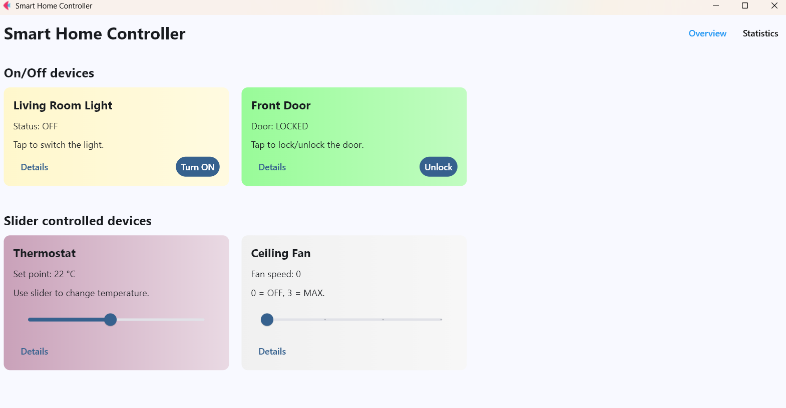
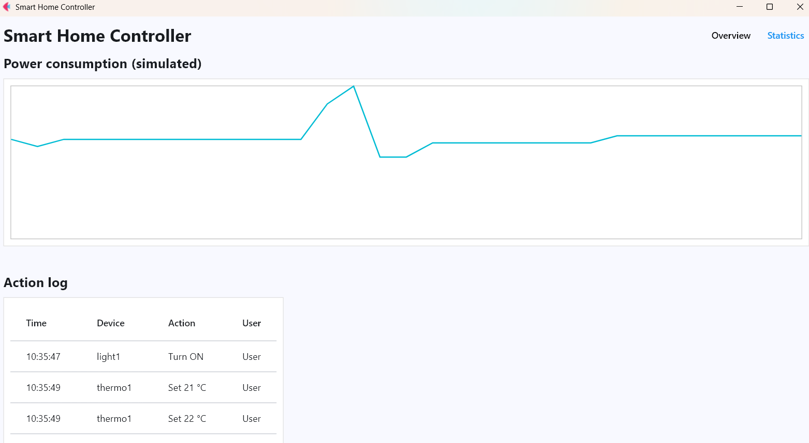
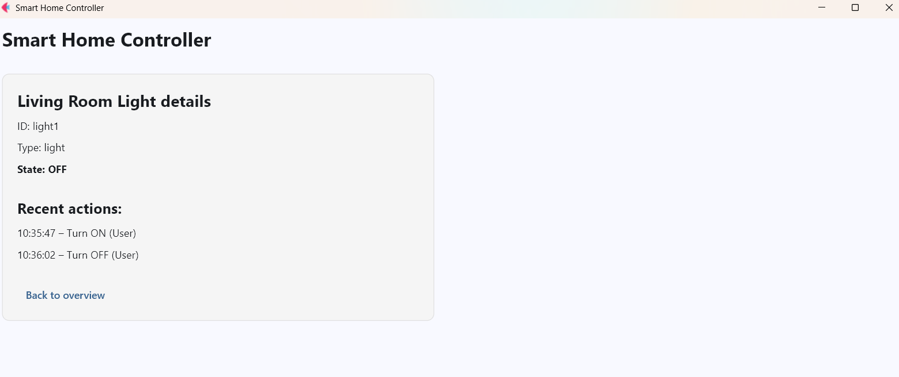

# Smart Home Controller 🏠

> Interactive desktop-style smart home control panel built with **Flet**. Monitor, control, and log your devices with real-time power simulation.

[](https://www.python.org/)
[](https://flet.dev/)

---

## 🚀 Features

- **Device Control**

  - Toggle lights On/Off
  - Lock/Unlock doors
  - Adjust thermostat temperature
  - Control fan speed (0–3)

- **Dynamic Visuals**

  - Gradient-based cards reflecting device states
  - Responsive UI with sliders for adjustable devices

- **Statistics & Logging**

  - Real-time action logging per device
  - Simulated power consumption chart
  - Action log table with timestamps

- **Device Details**

  - ID, type, and state per device
  - Recent actions history

- **Routing**

  - `/` → Overview page
  - `/stats` → Statistics & charts
  - `/details/<device>` → Detailed device view

---

## 🎯 Screenshots

**Overview Page**


**Statistics Page**


**Device Details Page**


_(Add actual screenshots to `screenshots/` folder)_

---

## 🛠 Installation

```bash
# Clone the repo
git clone <repository_url>
cd smart-home-controller

# Install dependencies
pip install flet
```

---

## ▶ Running the App

```bash
python main.py
```

- Opens a window (950x700) with a **light theme**.
- Navigate via tabs:

  - **Overview** – Control devices
  - **Statistics** – View power usage & action logs
  - **Details** – Inspect individual device info

---

## 📦 Code Structure

- **Device States**: `light_on`, `door_locked`, `thermostat_value`, `fan_speed`
- **UI Components**: Cards, sliders, buttons updated dynamically
- **Action Logging**: Stores per-device actions and user history
- **Power Simulation**: Calculates energy usage from device states
- **Gradient Functions**: Visual feedback for temperature, fan speed, light, and door
- **Routing**: Handles overview, stats, and detail pages

---

## ⚡ Extending the App

1. **Add new devices**:

   - Define state variable
   - Create UI card
   - Implement toggle or slider function
   - Update logging and gradients

2. **Enhance Power Simulation**:

   - Update `calc_power()` to include new devices

3. **Customize UI**:

   - Modify gradient colors or container styles

---

## 📜 License

MIT License – free to use and modify.
